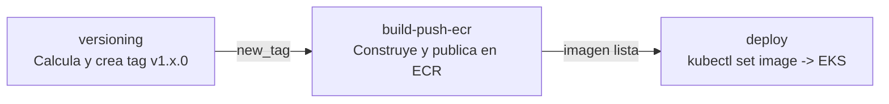

# ep03-db

Imagen Docker de PostgreSQL 16 para la capa de datos del sistema **Alumnos**. Incluye inicialización automática del esquema y datos de ejemplo listos para desarrollo.

> **Proyecto EFT — ISY1101 Introducción a Herramientas DevOps (Duoc UC)**
> Este repositorio es uno de los tres componentes del sistema **Gestor de Alumnos**, desplegado en **Amazon EKS**:
> - 🗄️ Base de datos (este repo): **ep03-database**
> - ⚙️ Backend: [ep03-backend](https://github.com/ikevin-p/ep03-backend)
> - 🖥️ Frontend: [ep03-frontend](https://github.com/ikevin-p/ep03-frontend)
>
> Guía del curso: [ISY1101-003V_EP03 · guia-04](https://github.com/mauriciovelasquezduoc/ISY1101-003V_EP03/tree/main/guia-04)

---

## Contenido

```
ep03-db/
├── Dockerfile          # Imagen basada en postgres:16-alpine
├── docker-compose.yml  # Orquestacion local con persistencia
├── init.sql            # Esquema y datos de ejemplo (auto-ejecutado)
├── pgdata/             # Directorio de datos persistentes (bind mount)
│   ├── data/           # Datos reales de PostgreSQL (en .gitignore)
│   └── .gitkeep
└── .gitignore          # Excluye pgdata/data/ del repositorio
```

---

## Requisitos

| Herramienta    | Version minima |
| -------------- | -------------- |
| Docker         | 20.10+         |
| Docker Compose | 2.0+           |

---

## Inicio rapido

### 1. Construir y levantar

```bash
docker compose up -d --build
```

### 2. Verificar que esta corriendo

```bash
docker compose ps
```

Esperar que el estado sea `healthy`:

```
NAME            STATUS                   PORTS
ep03-db   Up X seconds (healthy)   0.0.0.0:5432->5432/tcp
```

### 3. Conectarse a la base de datos

```bash
docker exec -it ep03-db psql -U ep03_user -d ep03
```

### 4. Detener el contenedor

```bash
docker compose down
```

> Los datos persisten en `./pgdata/` y se recuperan al volver a levantar el contenedor.

---

## Configuracion

### Variables de entorno

| Variable            | Valor por defecto | Descripcion              |
| ------------------- | ----------------- | ------------------------ |
| `POSTGRES_DB`       | `ep03`         | Nombre de la base de datos |
| `POSTGRES_USER`     | `ep03_user`    | Usuario de conexion      |
| `POSTGRES_PASSWORD` | `ep03_pass`    | Contrasena del usuario   |

Para sobreescribir los valores, edita la seccion `environment` en `docker-compose.yml` o usa un archivo `.env`:

```env
POSTGRES_DB=ep03
POSTGRES_USER=ep03_user
POSTGRES_PASSWORD=ep03_pass
```

### Puertos

| Puerto host | Puerto contenedor | Protocolo |
| ----------- | ----------------- | --------- |
| 5432        | 5432              | TCP       |

---

## Persistencia de datos

Los datos se almacenan en el directorio local `./pgdata/` mediante un **bind mount**. Esto garantiza que la informacion sobrevive a:

- `docker compose down` y `docker compose up`
- Reinicios del sistema
- Rebuilds de la imagen

```
ep03-db/
└── pgdata/
    └── data/        ← datos de PostgreSQL en tu maquina local
        ├── base/
        ├── global/
        └── ...
```

> `pgdata/` esta en `.gitignore` para evitar subir datos al repositorio. El archivo `.gitkeep` mantiene el directorio en el repo.

### Resetear la base de datos

Para borrar todos los datos y ejecutar `init.sql` desde cero:

```bash
docker compose down
rm -rf ./pgdata/data/*
docker compose up -d --build
```

---

## Esquema de la base de datos

Definido en `init.sql`, se ejecuta automaticamente en el primer arranque cuando `pgdata/` esta vacio.

### Tabla `ep03`

```sql
CREATE TABLE IF NOT EXISTS ep03 (
    id        BIGSERIAL    PRIMARY KEY,
    nombre    VARCHAR(100) NOT NULL,
    apellido  VARCHAR(100) NOT NULL
);
```

| Columna   | Tipo          | Restriccion  | Descripcion          |
| --------- | ------------- | ------------ | -------------------- |
| `id`      | BIGSERIAL     | PRIMARY KEY  | Identificador unico  |
| `nombre`  | VARCHAR(100)  | NOT NULL     | Nombre del alumno    |
| `apellido`| VARCHAR(100)  | NOT NULL     | Apellido del alumno  |

### Datos de ejemplo

El script inserta 8 registros iniciales para desarrollo:

| nombre    | apellido  |
| --------- | --------- |
| Juan      | Perez     |
| Ana       | Lopez     |
| Carlos    | Soto      |
| Maria     | Gonzalez  |
| Pedro     | Ramirez   |
| Sofia     | Munoz     |
| Diego     | Torres    |
| Valentina | Flores    |

---

## Comandos utiles

### Consultar datos

```bash
docker exec -it ep03-db psql -U ep03_user -d ep03 -c "SELECT * FROM ep03;"
```

### Ver logs del contenedor

```bash
docker compose logs -f ep03-db
```

### Verificar healthcheck

```bash
docker inspect --format='{{.State.Health.Status}}' ep03-db
```

### Backup de la base de datos

```bash
docker exec ep03-db pg_dump -U ep03_user ep03 > backup.sql
```

### Restaurar un backup

```bash
docker exec -i ep03-db psql -U ep03_user -d ep03 < backup.sql
```

---

## Imagen Docker

| Propiedad   | Valor                  |
| ----------- | ---------------------- |
| Base image  | `postgres:16-alpine`   |
| Imagen ECR  | `ep03-db:latest` |
| Puerto      | `5432`                 |
| Healthcheck | `pg_isready`           |

### Construir la imagen manualmente

```bash
docker build -t ep03-db:latest .
```

### Publicar en ECR

```bash
# Autenticarse en ECR
aws ecr get-login-password --region us-east-1 \
  | docker login --username AWS --password-stdin <ECR_REGISTRY>

# Tag y push
docker tag ep03-db:latest <ECR_REGISTRY>/ep03-db:latest
docker push <ECR_REGISTRY>/ep03-db:latest
```

---

## Contexto en la arquitectura

Este servicio forma parte de la arquitectura de 3 capas del sistema **Gestor de Alumnos**, desplegada en un clúster **Amazon EKS** (`laboratorio-ep03-eks`), dentro del namespace `ep03`:

```
Usuario
   |
AWS ELB (Load Balancer publico)
   |
Frontend  (Service: ep03-frontend, LoadBalancer) — Nginx :80
   |
Backend   (Service: ep03-backend, ClusterIP) — Spring Boot :8080
   |  JDBC
Database  (Service: ep03-database, ClusterIP) — PostgreSQL :5432   <-- este servicio
```

- Desplegada como `Deployment` de Kubernetes (`ep03-database`) con `strategy: Recreate` y 1 réplica — no forma parte del autoescalado horizontal (HPA), ya que es una instancia única de base de datos en este proyecto de laboratorio.
- Expuesta únicamente vía `Service` tipo `ClusterIP` (`ep03-database:5432`): sin IP pública ni acceso directo desde internet, solo alcanzable desde dentro del namespace `ep03` (en la práctica, solo el backend se conecta a ella).
- La contraseña de PostgreSQL se gestiona como `Secret` de Kubernetes (`database-secret`), referenciada por el `Deployment` vía `secretKeyRef` — nunca en texto plano en el manifiesto.
- `readinessProbe`/`livenessProbe` de tipo `tcpSocket` sobre el puerto 5432, para que Kubernetes solo enrute tráfico al pod cuando el motor de base de datos esté aceptando conexiones.
- Los datos usan `emptyDir` como volumen en este entorno de laboratorio: al recrearse el pod, el esquema se reinicializa automáticamente desde `init.sql`. En un entorno productivo real se reemplazaría por un volumen persistente (`PersistentVolumeClaim`).

## Notas de seguridad

- Las credenciales por defecto del `Dockerfile`/`docker-compose.yml` son solo para desarrollo local.
- En el clúster EKS, la contraseña de PostgreSQL se inyecta exclusivamente desde un `Secret` de Kubernetes (`database-secret`), nunca como variable de entorno en texto plano en el `Deployment`.
- El puerto 5432 no se expone públicamente en ningún entorno: en EKS, el `Service` es `ClusterIP` (solo red interna del clúster).

---

## CI/CD — GitHub Actions

El pipeline está definido en [`.github/workflows/deploy-database-eks.yml`](.github/workflows/deploy-database-eks.yml) y se ejecuta automáticamente en cada `push` a `main` (también soporta `workflow_dispatch` manual). Orquesta tres jobs secuenciales: versionado semántico, publicación en ECR y despliegue en **Amazon EKS**.

### Flujo del pipeline



### Job 1 — Versioning

Calcula automáticamente la siguiente versión semántica (`v1.x.0`): busca el último tag `v1.*`, incrementa el número menor (o inicia en `v1.0.0` si no existe ninguno) y publica el tag con `github-actions[bot]`.

### Job 2 — Build & Push ECR

Construye la imagen Docker (incluye `init.sql`) y la publica en Amazon ECR con dos tags simultáneos:

| Tag publicado | Ejemplo | Uso |
|---|---|---|
| Versión semántica | `ep03-database:v1.4.0` | Trazabilidad histórica |
| `latest` | `ep03-database:latest` | Tag usado por el paso de despliegue |

Usa GitHub Actions Cache (`type=gha`) para reutilizar capas Docker entre ejecuciones.

### Job 3 — Deploy a EKS

1. Configura credenciales AWS temporales (Learner Lab) y genera el `kubeconfig` con `aws eks update-kubeconfig --name laboratorio-ep03-eks`.
2. Elimina el pod actual de base de datos para forzar su recreación con las probes/configuración más recientes.
3. Actualiza la imagen del `Deployment`: `kubectl set image deployment/ep03-database database=<ECR>/ep03-database:latest -n ep03`.
4. Espera (con polling, máx. 5 minutos) a que el pod quede en estado `Running`; si entra en `ImagePullBackOff`, `ErrImagePull` o `CrashLoopBackOff`, el job falla e imprime los comandos de diagnóstico sugeridos.
5. Verifica el estado final: pods, `Service` y últimas líneas de logs.

### Secrets requeridos (GitHub Secrets)

| Secret | Descripción |
| ------ | ----------- |
| `AWS_ACCESS_KEY_ID` / `AWS_SECRET_ACCESS_KEY` / `AWS_SESSION_TOKEN` | Credenciales temporales del AWS Academy Learner Lab |
| `AWS_REGION` | `us-east-1` |
| `EKS_CLUSTER_NAME` | `laboratorio-ep03-eks` |

### Permisos del workflow

| Permiso | Nivel | Razón |
| ------- | ----- | ----- |
| `contents: write` | Repositorio | Crear y publicar tags git |
